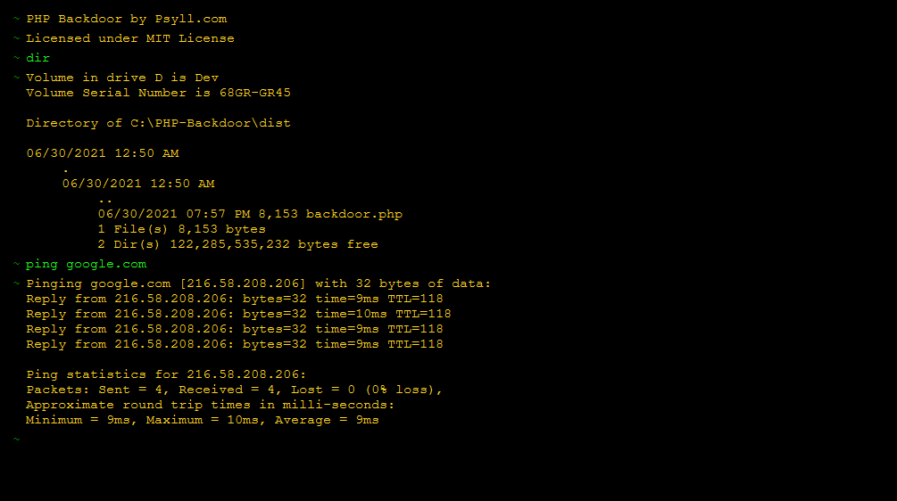

# PHP Backdoor v3

	
	
	
	
	

## Projects links

- Github Repistory: [https://github.com/psyll/PHP-Backdoor/](https://github.com/psyll/PHP-Backdoor)
- Github Pages: [https://psyll.github.io/PHP-Backdoor/](https://psyll.github.io/PHP-Backdoor)
- Homepage: [https://psyll.com/en/php-backdoor](https://psyll.com/en/php-backdoor)

## Table of contents

  * [Introduction](#introduction)
  * [Installation](#installation)
  * [Additional commands](#additional-commands)
  * [Authors](#authors)
  * [&#9760; Use with caution](#-use-with-caution)
  * [Changelog](#changelog)
  * [License](#license)

## Introduction

PHP Backdoor is a web-based application that allows to execute terminal commands on a server directly from a browser. The application is built in single php file. The size of the terminal file is less than `~10 KB`

## Installation

- [`Download`](https://github.com/psyll/PHP-Backdoor/releases) latest release
- `Upload` **dist/backdoor.php** file to your server
- `Run` script by url **[your domain]/backdoor.php**
- `Join it`

## Additional commands

- `cls` clear console screen
- `reset` reset console

## Authors

- `Jarek Szulc` <jarek@psyll.com>
- `Psyll.com` <dev@psyll.com>

##  &#9760; Use with caution

This script represents a security risk for the server. Do not upload it on a server until you know what you are doing!

## Changelog

[View changelog](https://github.com/psyll/PHP-Backdoor/blob/master/CHANGELOG.md)

## License

Licensed under the `MIT License`

[View license](https://github.com/psyll/PHP-Backdoor/blob/master/LICENSE)
